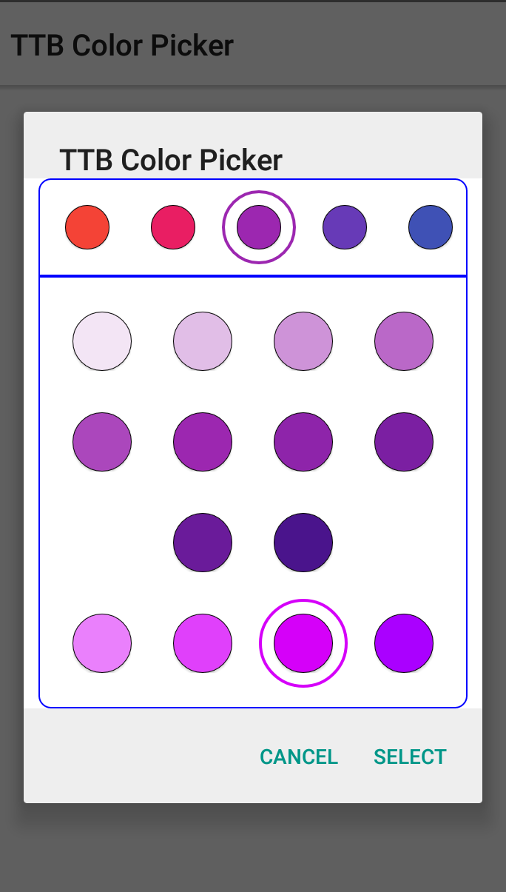

# ttb-color-picker
A list of material design colors dialog for android

# Simple Get the Selected Color
```java
new ColorPickerDialog(this)
  .setTitle("Select A Text Color")
  .setOnColorSelectListener(new OnColorSelectedListener(){
      @Override
      public void onColorSelected(int color, String hexColor, int[] rgb){
         text.setTextColor(color);
    }
}).show();
```
